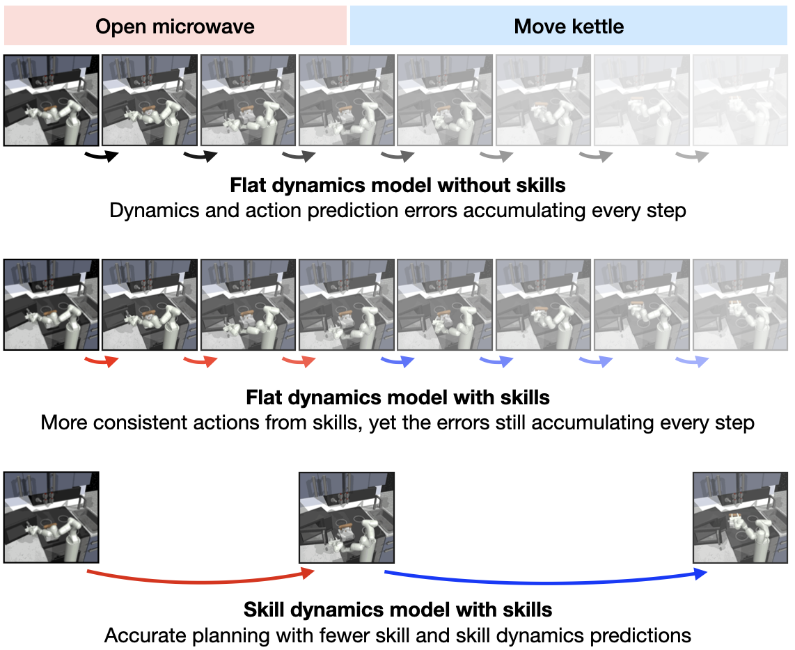
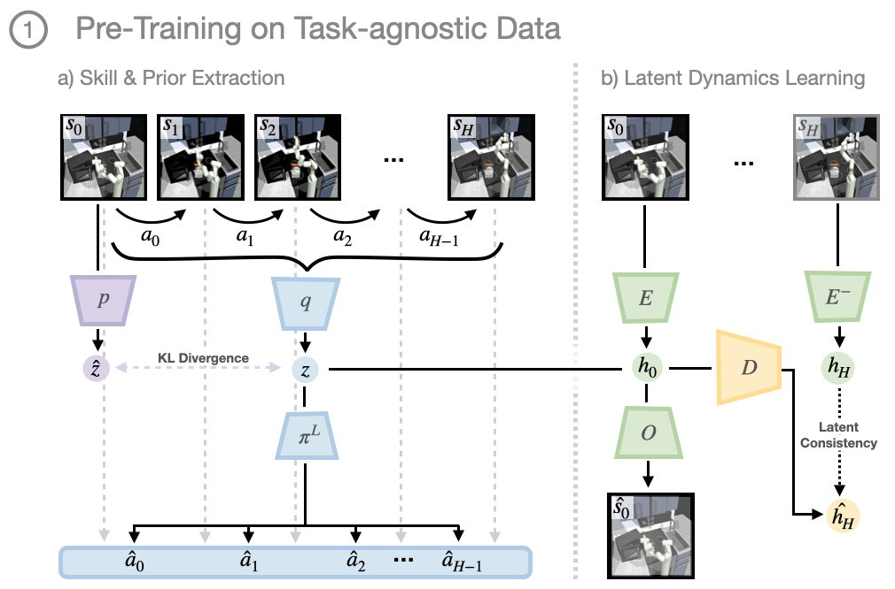
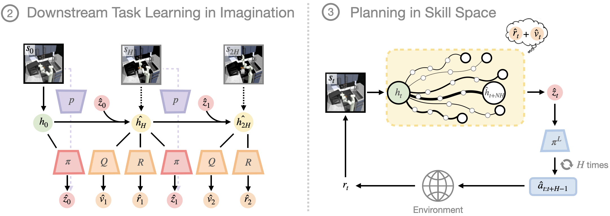

----


## Motivation

A key trait of human intelligence is the ability to plan abstractly for solving complex tasks. For instance, we perform cooking by imagining outcomes of high-level skills like washing and cutting vegetables, instead of planning every muscle movement involved. This ability to plan with temporally-extended skills helps to scale our internal model to long-horizon tasks by reducing the search space of behaviors.
<!--To apply this insight to artificial intelligence agents, we propose a novel skill-based and model-based RL method, which learns a model and a policy in a high-level skill space, enabling accurate long-term prediction and efficient long-term planning.-->


----


## Skill dynamics model

Instead of predicting the immediate future state, our <b>skill dynamics model</b> predicts the resultant state after a skill execution. Here are two key advantages of using the skill dynamics model:
* <b>Accurate long-term prediction</b>: it decreases compounding errors from modeling every single-step transitions and actions.
<!-- does not model every intermediate step and low-level action.  -->
* <b>Efficient long-horizon planning</b>: it allows temporal abstraction in both the skills and dynamics model, so the agent can do efficient, temporally-extended reasoning with fewer predictions required.
<!-- without having to model step-by-step action sequences or dynamics -->
<!-- requires only a few number of skill and skill dynamics predictions. -->

<!--The skill dynamics model can predict the long-term future more accurately because it does not need to model every intermediate step and low-level action, resulting in smaller error accumulation over time. In addition, a long-horizon plan can be efficiently found as planning requires only a few number of skill and skill dynamics predictions.-->
<!--Therefore, together with skills, the skill dynamics model allows reliable long-term future prediction and planning, resulting in efficient downstream RL with temporally-extended reasoning.-->




----


## Skill-based Model-based RL (SkiMo)

SkiMo consists of two phases: (1) pre-training the skill dynamics and skill repertoire from an offline task-agnostic dataset and (2) downstream RL with the learned skill dynamics model.


In pre-training, SkiMo leverages offline data to extract (1) skills for temporal abstraction of actions, (2) skill dynamics for skill-level planning on a latent state space, and (3) a <a href="https://clvrai.com/spirl" target="_blank">skill prior</a> to guide exploration. We jointly train the skill dynamics model and skill policy, such that the latent skill space can be shaped for skill execution as well as easy skill dynamics prediction.



In downstream RL, we propose to learn a high-level task policy in the skill space (skill-based RL). Further, we propose to leverage the skill dynamics model to find an optimal plan in the skill space as well as generating imaginary skill trajectories for policy optimization (model-based RL).




----


## Tasks

We evaluate our method on four long-horizon, sparse-reward tasks: <a href="https://sites.google.com/view/d4rl/home" target="_blank">2D maze navigation</a>, <a href="https://sites.google.com/view/d4rl/home" target="_blank">two robotic kitchen manipulation</a>, and <a href="http://calvin.cs.uni-freiburg.de/" target="_blank">tabletop manipulation</a>.


----


## Maze

The green point mass navigates the maze to reach the goal (red). It poses a hard exploration problem due to the sparsity of the reward (binary reward after taking 1,000+ steps to reach the goal).

<table style="width:100%; margin: auto; max-width: 1200px; table-layout: fixed;">
<tbody>
  <tr style="border-bottom: none;">
    <td style="text-align: center">
        <figcaption class="imgcaption">SkiMo (Ours)</figcaption>
    </td>
    <td style="text-align: center">
        <figcaption class="imgcaption">Dreamer</figcaption>
    </td>
    <td style="text-align: center">
        <figcaption class="imgcaption">SPiRL</figcaption>
    </td>
    <td style="text-align: center">
        <figcaption class="imgcaption">SPiRL+Dreamer</figcaption>
    </td>
    <td style="text-align: center">
        <figcaption class="imgcaption">SkiMo w/o joint training</figcaption>
    </td>
  </tr>
  <tr style="border-bottom: none;">
    <td style="text-align: center">
        <video id="round" height="auto" width="95%" controls autoplay loop muted>
            <source src="video/maze/ours2.mp4" type="video/mp4">
        </video>
    </td>
    <td style="text-align: center">
        <video id="round" height="auto" width="95%" controls autoplay loop muted>
            <source src="video/maze/dreamer2.mp4" type="video/mp4">
        </video>
    </td>
    <td style="text-align: center">
        <video id="round" height="auto" width="95%" controls autoplay loop muted>
            <source src="video/maze/spirl2.mp4" type="video/mp4">
        </video>
    </td>
    <td style="text-align: center">
        <video id="round" height="auto" width="95%" controls autoplay loop muted>
            <source src="video/maze/spirl+dreamer2.mp4" type="video/mp4">
        </video>
    </td>
    <td style="text-align: center">
        <video id="round" height="auto" width="95%" controls autoplay loop muted>
            <source src="video/maze/skimo_wo_joint_training2.mp4" type="video/mp4">
        </video>
    </td>
  </tr>
</tbody>
</table>

Experiments show that only SkiMo is able to consistently find the goal, whereas baselines frequently get stuck in doorways and hallways due to the challenges in long-term planning and learning with sparse feedback (also see quantitative & qualitative results below).

----


## Kitchen
The robot arm must complete four manipulation tasks in the correct order (Microwave - Kettle - Bottom Burner - Light).

<table style="width:100%; margin: auto; max-width: 1200px; table-layout: fixed;">
<tbody>
  <tr style="border-bottom: none;">
    <td style="text-align: center">
        <figcaption class="imgcaption">SkiMo (Ours)</figcaption>
    </td>
    <td style="text-align: center">
        <figcaption class="imgcaption">Dreamer</figcaption>
    </td>
    <td style="text-align: center">
        <figcaption class="imgcaption">SPiRL</figcaption>
    </td>
    <td style="text-align: center">
        <figcaption class="imgcaption">SPiRL+Dreamer</figcaption>
    </td>
    <td style="text-align: center">
        <figcaption class="imgcaption">SkiMo w/o joint training</figcaption>
    </td>
  </tr>
  <tr style="border-bottom: none;">
    <td style="text-align: center">
        <video id="round" height="auto" width="95%" controls autoplay loop muted>
            <source src="video/kitchen/ours2.mp4" type="video/mp4">
        </video>
    </td>
    <td style="text-align: center">
        <video id="round" height="auto" width="95%" controls autoplay loop muted>
            <source src="video/kitchen/dreamer2.mp4" type="video/mp4">
        </video>
    </td>
    <td style="text-align: center">
        <video id="round" height="auto" width="95%" controls autoplay loop muted>
            <source src="video/kitchen/spirl2.mp4" type="video/mp4">
        </video>
    </td>
    <td style="text-align: center">
        <video id="round" height="auto" width="95%" controls autoplay loop muted>
            <source src="video/kitchen/spirl+dreamer2.mp4" type="video/mp4">
        </video>
    </td>
    <td style="text-align: center">
        <video id="round" height="auto" width="95%" controls autoplay loop muted>
            <source src="video/kitchen/skimo_wo_joint_training2.mp4" type="video/mp4">
        </video>
    </td>
  </tr>
</tbody>
</table>

Skimo demonstrates the ability to compose skills learned from task-agnostic data and plan efficiently in the skill space. It can learn all 4 tasks in kitchen, whereas the best baseline only learns up to 3 tasks even with 5x more samples.

----


## Mis-aligned Kitchen

The task sequence (Microwave - Light - Slide Cabinet - Hinge Cabinet) is mis-aligned with the offline data distribution, which makes downstream RL more challenging.

<table style="width:100%; margin: auto; max-width: 1200px; table-layout: fixed;">
<tbody>
  <tr style="border-bottom: none;">
    <td style="text-align: center">
        <figcaption class="imgcaption">SkiMo (Ours)</figcaption>
    </td>
    <td style="text-align: center">
        <figcaption class="imgcaption">Dreamer</figcaption>
    </td>
    <td style="text-align: center">
        <figcaption class="imgcaption">SPiRL</figcaption>
    </td>
    <td style="text-align: center">
        <figcaption class="imgcaption">SPiRL+Dreamer</figcaption>
    </td>
    <td style="text-align: center">
        <figcaption class="imgcaption">SkiMo w/o joint training</figcaption>
    </td>
  </tr>
  <tr style="border-bottom: none;">
    <td style="text-align: center">
        <video id="round" height="auto" width="95%" controls autoplay loop muted>
            <source src="video/misaligned_kitchen/ours2.mp4" type="video/mp4">
        </video>
    </td>
    <td style="text-align: center">
        <video id="round" height="auto" width="95%" controls autoplay loop muted>
            <source src="video/misaligned_kitchen/dreamer2.mp4" type="video/mp4">
        </video>
    </td>
    <td style="text-align: center">
        <video id="round" height="auto" width="95%" controls autoplay loop muted>
            <source src="video/misaligned_kitchen/spirl2.mp4" type="video/mp4">
        </video>
    </td>
    <td style="text-align: center">
        <video id="round" height="auto" width="95%" controls autoplay loop muted>
            <source src="video/misaligned_kitchen/spirl+dreamer2.mp4" type="video/mp4">
        </video>
    </td>
    <td style="text-align: center">
        <video id="round" height="auto" width="95%" controls autoplay loop muted>
            <source src="video/misaligned_kitchen/skimo_wo_joint_training2.mp4" type="video/mp4">
        </video>
    </td>
  </tr>
</tbody>
</table>

Nonetheless, we find SkiMo to robustly adapt to the new distribution of behaviors, at least 3x faster than all baselines.

----


## CALVIN

The robot arm needs to compose skills (Open Drawer - Turn on Lightbulb - Move Slider Left - Turn on LED) learned from *extremely*  task-agnostic data. This setup mimics real-world large-scale robot learning, where the robot may not receive a carefully curated dataset.

<table style="width:100%; margin: auto; max-width: 1200px; table-layout: fixed;">
<tbody>
  <tr style="border-bottom: none;">
    <td style="text-align: center">
        <figcaption class="imgcaption">SkiMo (Ours)</figcaption>
    </td>
    <td style="text-align: center">
        <figcaption class="imgcaption">Dreamer</figcaption>
    </td>
    <td style="text-align: center">
        <figcaption class="imgcaption">SPiRL</figcaption>
    </td>
    <td style="text-align: center">
        <figcaption class="imgcaption">SPiRL+Dreamer</figcaption>
    </td>
    <td style="text-align: center">
        <figcaption class="imgcaption">SkiMo w/o joint training</figcaption>
    </td>
  </tr>
  <tr style="border-bottom: none;">
    <td style="text-align: center">
        <video id="round" height="auto" width="95%" controls autoplay loop muted>
            <source src="video/calvin/ours2.mp4" type="video/mp4">
        </video>
    </td>
    <td style="text-align: center">
        <video id="round" height="auto" width="95%" controls autoplay loop muted>
            <source src="video/calvin/dreamer2.mp4" type="video/mp4">
        </video>
    </td>
    <td style="text-align: center">
        <video id="round" height="auto" width="95%" controls autoplay loop muted>
            <source src="video/calvin/spirl2.mp4" type="video/mp4">
        </video>
    </td>
    <td style="text-align: center">
        <video id="round" height="auto" width="95%" controls autoplay loop muted>
            <source src="video/calvin/spirl+dreamer2.mp4" type="video/mp4">
        </video>
    </td>
    <td style="text-align: center">
        <video id="round" height="auto" width="95%" controls autoplay loop muted>
            <source src="video/calvin/skimo_wo_joint_training2.mp4" type="video/mp4">
        </video>
    </td>
  </tr>
</tbody>
</table>

Experiments show that SkiMo is the only method that accomplishes all 4 tasks in CALVIN and remains highly sample-efficient albeit a mismatch between offline data and downstream task. This offers an exciting opportunity to practical robot learning, where data may not be task-specific and the robot needs to extract as much reusable knowledge as possible for efficient learning.

----


## Quantitative results

<!--  -->
<div class="w3-row-padding">
    
    <figcaption class="imgcaption">Comparisons to baseline methods</figcaption>
</div>


----


## Ablation study

<!--  -->
<div class="w3-row-padding">
    
    <figcaption class="imgcaption">Comparisons to ablated methods</figcaption>
</div>

----


## Qualitative results


### Long-horizon Prediction with Skill Dynamics Model

Prediction results of 500 timesteps using (a) flat single-step model  and (b) skill dynamics model. The predicted states from the flat model deviate from the ground truth trajectory quickly while the prediction of the skill dynamics model has little error.

<div class="w3-row-padding">
    
    <figcaption class="imgcaption">Visualization of imagined trajectories</figcaption>
</div>

### Exploration and Exploitation

We visualize trajectories in the replay buffer at 1.5M training steps in blue (light blue for early trajectories and dark blue for recent trajectories). Our method shows wide coverage of the maze at the early stage of training, and fast convergence to the solution.

<div class="w3-row-padding">
    
    <figcaption class="imgcaption">Visualization of exploration and exploitation behaviors</figcaption>
</div>


----


## Citation
```
@article{shi2022skimo,
  title={Skill-based Model-based Reinforcement Learning},
  author={Lucy Xiaoyang Shi and Joseph J. Lim and Youngwoon Lee},
  journal={arXiv preprint arXiv:2207.07560},
  year={2022}
}
```
<br>
